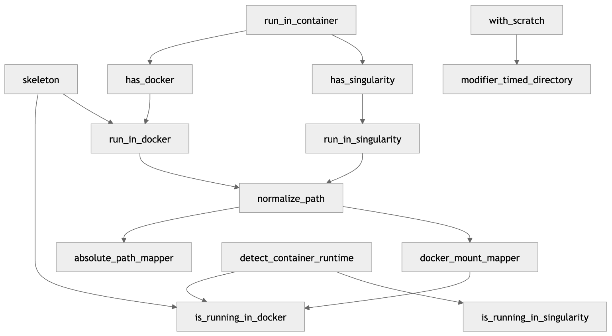
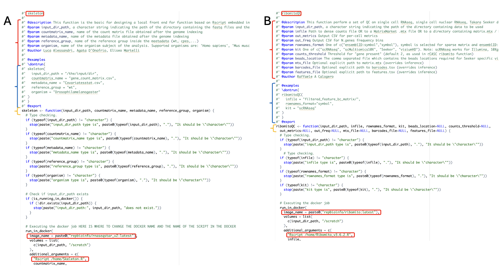
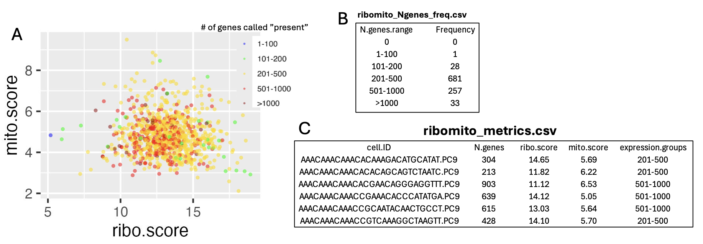
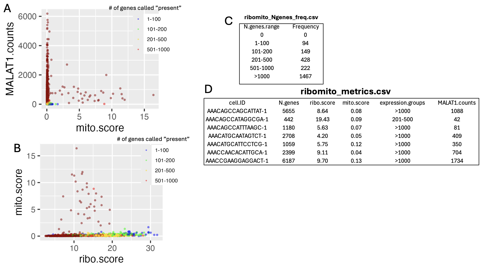
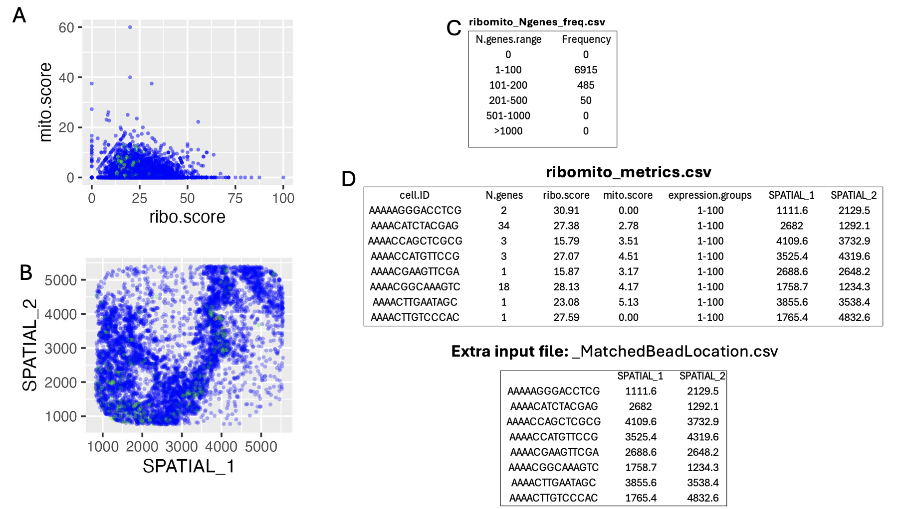

# toolbox

``` r
library(toolbox)
```

## Overview

This package is a generalised container for a variety of front-end
function that execute complex workflows embedded in docker container.
The package includes a set of core functions which are required to allow
the front-end function to work in different environments like MAC OS,
Windows and Linux. The over all structure of the front-end is shown in
figure1  The package contains also a very simple
skeleton function that can be used as template for the creation of a new
function. the elements to be modified in the skeleton are shown in
figure 2,  Panel A show the skeleton and panel B
the modifications made in the ribomito_qc function. **IMPORTANT**: The
input-dir_path in sketelon function must not be removed! It refer to the
folder where the data are located in your computer and this folder will
be mount as /scratch in the docker container. Here, instead you can find
the header of the R script present in the repbioinfo/ribomito docker
container.

``` r
#!/usr/bin/env Rscript

  library(data.table)
  library(Matrix)
  library(ggplot2)

# versione 3.1 mat_dgC <- as(mat_dgC, "dgCMatrix") was changed in mat_dgC <- as(mat_dgC, "CsparseMatrix"), since dgCMatrix is deprecated
# expression binning was inserted in the in the output file
...
#Version 3.6 support visium HD spatial transcriptomics output: embedding bc2cellid function, see below

setwd("/scratch")
args <- commandArgs(trailingOnly = TRUE)
if (length(args) < 1) {
  stop("Usage: Rscript Ribomito_v3.6.2.R <infile> <rownames_format> <kit> [beads_location] [counts_threshold] [out_metrics] [out_freq] [mtx_file] [barcodes_file] [features_file]")
}

infile <- ifelse(length(args) >= 1, args[1])
rownames_format <- ifelse(length(args) >= 2, args[2], "symbol")
kit <- ifelse(length(args) >= 3, args[3], "scRNAseq")
beads_location <- if (length(args) >= 4) args[4] else NULL
counts_threshold <- ifelse(length(args) >= 5, as.numeric(args[5]), 2)
out_metrics <- ifelse(length(args) >= 6, args[6], "ribomito_metrics.csv")
out_freq <- ifelse(length(args) >= 7, args[7], "ribomito_freq.csv")
mtx_file <- if (length(args) >= 8) args[8] else NULL
barcodes_file <- if (length(args) >= 9) args[9] else NULL
features_file <- if (length(args) >= 10) args[10] else NULL

#' ribomito_qc
#'
#' Compute per-cell QC metrics: N.genes (counts > 2), ribo.score (%), mito.score (%)
#' Supports:
...
ribomito_qc <- function(infile,
                            rownames_format = c("ensemblID:symbol", "symbol"),
                              kit = c("scRNAseq", "scMultiomics10X", "Seeker", "visiumHD"),
                              beads_location = NULL,
                            counts_threshold = 2,
                out_metrics = "ribomito_metrics.csv",
                out_freq = "ribomito_Ngenes_freq.csv",
                mtx_file = NULL,
                barcodes_file = NULL,
                features_file = NULL) {
...
}
ribomito_qc(infile=infile, rownames_format=rownames_format, kit=kit, beads_location=beads_location, out_metrics=out_metrics, out_freq=out_freq, 
    mtx_file=mtx_file, barcodes_file=barcodes_file, features_file=features_file, counts_threshold=counts_threshold)
```

As you can see the parameters provided by the front-end function will be
passed to this script and the script will take care of executing the
code requested for the analysis.

## Implemented tools

### ribomitoQC

This function is an evolution of the mitoRiboUmi function available in
the \[[rCASC
package](https://kendomaniac.github.io/rCASC/reference/mitoRiboUmi.html)\].
The current implementation extends the functionality of the original
function to sparse matrices and provides additional QC information for
several single-cell platforms, including: 10x Genomics/Illumina
single-cell RNA-seq (dense and sparse matrices), 10x Genomics
single-nucleus RNA-seq (sparse matrices), Takara Seeker spatial
transcriptomics (dense comma-separated matrices), and 10x Genomics
Visium HD (sparse matrices). Support for the latter is still under
development and requires further refinement. An example dataset for
testing ribomitoQC is available on
\[[Zenodo](https://doi.org/10.5281/zenodo.19216861)\].

Figure 3, shows the output for scRNA-seq data generated with the 10x
Genomics/Illumina single-cell RNA-seq platform. 

Panel A reports the percentage of counts associated with mitochondrial
proteins plotted against the percentage of counts associated with
ribosomal proteins. Each dot represents a cell and is colored according
to the number of detected genes. In this case, we used the threshold
defined in the \[[rCASC
paper](https://academic.oup.com/gigascience/article/8/9/giz105/5565135)\]
paper, where more than 2 UMIs are required for a gene to be considered
detected. Panel B shows the frequency distribution of cells across
ranges of detected genes. Panel C provides the data used to generate the
plot shown in Panel A.

Figure 4 shows the output for single-nucleus RNA-seq data generated with
the 10x Genomics platform. 

Panel A shows MALAT1 long non-coding RNA expression plotted against the
percentage of mitochondrial gene counts. MALAT1 appears to be a marker
of good cell quality when associated with low mitochondrial
contamination. Panel B reports the percentage of counts associated with
mitochondrial proteins plotted against the percentage associated with
ribosomal proteins. Each dot represents a cell and is colored according
to the number of detected genes. Also in this case, we used the
threshold defined in the \[[rCASC
paper](https://academic.oup.com/gigascience/article/8/9/giz105/5565135)\]
paper, where more than 2 UMIs are required to call a gene as detected.
Panel C shows the frequency distribution of cells across ranges of
detected genes. Panel D provides the data used to generate the plots
shown in Panels A and B.

Figure 5 shows the output for Takara Seeker spatial transcriptomics
data.  Panel A reports the percentage of counts
associated with mitochondrial proteins plotted against the percentage
associated with ribosomal proteins. Each dot represents a cell and is
colored according to the number of detected genes. As above, we used the
threshold defined in the [rCASC
paper](https://academic.oup.com/gigascience/article/8/9/giz105/5565135)
paper, where more than 2 UMIs are required for a gene to be considered
detected. Panel B shows the same data mapped according to tissue
location. Panel C shows the frequency distribution of cells across
ranges of detected genes. Panel D provides the data used to generate the
plots shown in Panels A and B. To generate this output, the input must
also include a file describing the spatial location of each barcode.
